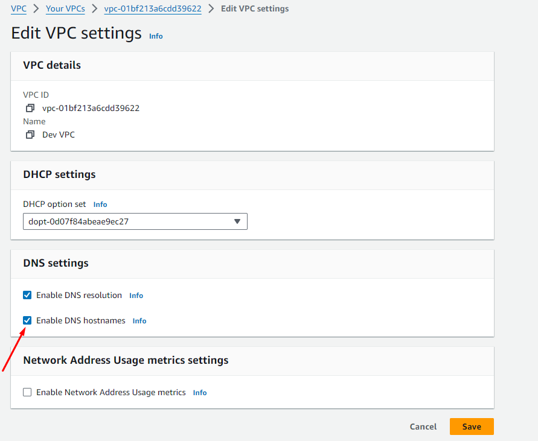
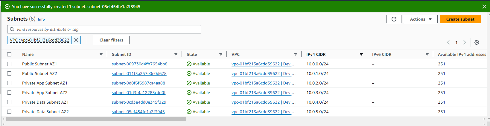
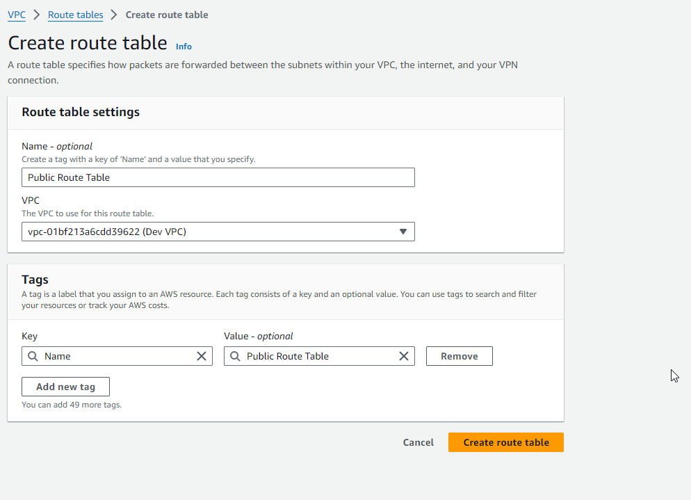
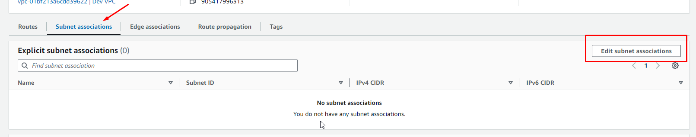
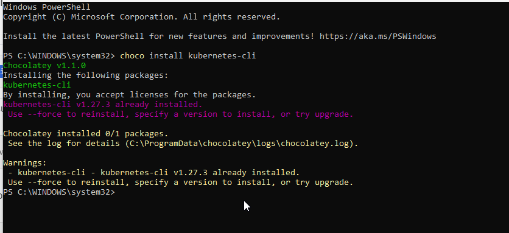

The VPC is going to hold all of our resources, the first thing we are going to do is select our Region on the upper right hand corner select the reegion where you want create your VPC (us-east-1)

Now that we have created the VPC, the next thing todo is to enable the DNS hostname in the VPC, this simplifies the process of managing and connection of resources in the 

CREATE INTERNET GATEWAY

Now that the Internet Gateway is created, it is time to attach it to our VPC

CREATE SUBNETS

NOW its time to enable the auto-assign IP on the Public Subnets

Create Route Table for Public Subnets to have internet

SUBNET ASSOCIATION

CREATING NAT GATEWAYS

Nat Gateway allows resources in the Private Subnte in the VPC to have internet, For high availaility and fault tolerance we will create 2 Nat Gateways. But in this case we wil create 1 Nat Gateway to save costs and we will associate all our Private Subnets with the Nat Gateway.

Setting Up Private Subnets Route Table

Asoociate all the private subnest with the route table

Security Groups

1. Will be attached to the EC2 instnace connect end-point - port 22
2. Attach to the EC2 instance we will use to migrate data to RDS - PORT 22
3. RDS instance security group - port 3306

CREATE ENDPOINT

AMAZON RDS SUBNETS

AMAZON RDS

## Docker

### Building and Pushing Docker Image to ECR

S3 Bucket Setup and SQL Script Upload

Upload SQL script to S3 bucket

Create IAM Role with S3 Access

Next Launch an EC2 Instance in the Private App Subnet

We use this instance to migrate our data to RDS

#### Data Migration to RDS

#### EC2 Instance Termination

### Install kubectl, eksctl, and Helm

### Create a Secret in Secret Manager

Add all the envirnoment variables in our dockerfile as secrets in the aws secretes manager

Now lets enable the EKS Cluster to retrive the secret we stored, we create an IAM policy

EKS Cluster IAM Role Creation

Before we create an EKS cluster, we first have to create an IAM role for the cluster https://docs.aws.amazon.com/eks/latest/userguide/service_IAM_role.html#create-service-role

